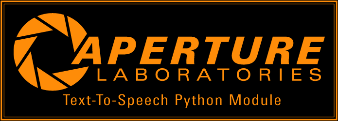

# GLaDOS Text-To-Speech Engine
Adapted from [dnhkng's GLaDOS repository](https://github.com/dnhkng/GlaDOS).

<p align="center"></p>

Add [the evil robot](https://en.wikipedia.org/wiki/GLaDOS) to your Python project as easy as:
```python
import glados

tts = glados.TTS()
tts.speak_text_aloud("Hello, World!")
```

Find more usage options [here](#Usage)!

# Installation

## Windows
### Pre-Built Portable Executables (CPU only)
If you just want to quickly make some GLaDOS TTS speech and don't really care about writing custom code, simply download the latest portable builds [here](https://github.com/nimaid/GLaDOS-TTS/releases/latest). All you have to do is download and run your preferred `.exe` file!

### Full Installation (CPU only or CUDA accelerated)
1. Install with `install_windows.bat`. This should automatically:
   1. Install Miniconda if you don't already have `pip` or a `conda` binary
   2. Install the Conda environment (with CUDA and CuDNN if you want!)
   3. Download the required model files if not already present
2. Run the interactive console demo with `run_console_windows.bat`

## Linux / Mac
1. Install [Miniconda](https://www.anaconda.com/download/success) if you do not have `conda` already installed.
   - Linux
      - [64-Bit x86](https://repo.anaconda.com/miniconda/Miniconda3-latest-Linux-x86_64.sh)
      - [64-Bit ARM64](https://repo.anaconda.com/miniconda/Miniconda3-latest-Linux-aarch64.sh)
   - Mac
      - [64-Bit x86 (Intel)](https://repo.anaconda.com/miniconda/Miniconda3-latest-MacOSX-x86_64.pkg)
      - [64-Bit ARM64 (Apple)](https://repo.anaconda.com/miniconda/Miniconda3-latest-MacOSX-arm64.pkg)
2. Install the Conda environment with one of the following commands:
   - GPU accelerated: `conda env create -f environment_cuda.yaml`
   - CPU only: `conda env create -f environment.yaml`
3. Download the required models with one of the following commands:
   - Linux: `download_models_ubuntu.bash`
   - Mac: `download_models_mac.command`
4. Run the interactive console demo with `conda run -n glados python speak_console.py`

# Usage

## From An Interactive GUI
<p align="center"></p>

You can get this a portable `.exe` file for Windows [here](https://github.com/nimaid/GLaDOS-TTS/releases/latest/download/speak_console.exe).

This is the suggested way to quickly generate messages. After it loads the models, it is actually very fast. It usually takes a fraction of a second to generate a message.

To run the installed version:

`conda run -n glados python speak_console.py`

There is a fixed delay between messages. By default this is `0.5` seconds, but you can change it with the `-d`/`--delay` parameter.

There is an automatic greeting message that plays on startup. You can change this with the `-g`/`--greeting` parameter.

You can also completely disable the greeting message wit the `-ng`/`--no-greet` flag.

## From The Command Line
<p align="center"></p>

You can get this a portable `.exe` file for Windows [here](https://github.com/nimaid/GLaDOS-TTS/releases/latest/download/speak.exe).

This has to load the models every single time it runs, so it can be a bit slow.

`conda run -n glados python speak.py -t "Hello, command line!"`

You can optionally choose to save to a `.wav` file with the `-o`/`--output` parameter followed by the desired filename.

If you want to avoid reading the text aloud, use the `-q`/`--quiet` flag. This is useful when you just want to make a `.wav` file with the `-o` parameter.

## In Custom Code
<p align="center"></p>

Below is a more comprehensive example of using the module in your own code.

```python
import time  # For making delays
import glados  # Import the local module

# Create a reusable text-to-speech object (this will take some time to load the AI models)
tts = glados.TTS()

# Say some long text, delay 1 second, and then move on to the next line of code
# The speech will continue in the background until it finishes or is interrupted
tts.speak_text_aloud_async("Calcium is a soft, silvery-white metal and one of the most abundant elements on Earth.")
time.sleep(1)

# Say some text and wait until it is done being spoken
# If the previous speech isn't over yet, this will interrupt it
tts.speak_text_aloud("Hello, and thank you, world.")

# Manually stop the speech playback
tts.stop_audio()

# Generate audio to a Numpy array
audio = tts.generate_speech_audio("Wow, my voice is now stored directly in your random access memory.")

# Play the generated audio back, delay 1 second, and then move on to the next line of code
tts.play_audio_async(audio)
time.sleep(1)

# Restart the audio playback and wait until it's done this time.
tts.play_audio(audio)

# Save the generated audio as a wave file
tts.save_wav(audio, "example.wav")
```